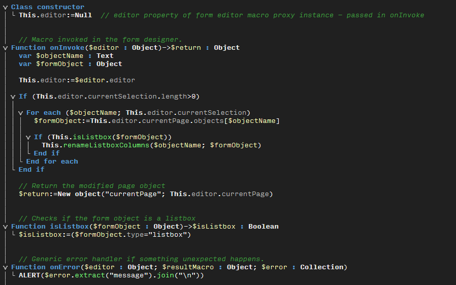

# Dark Theme v18

To apply the dark theme please follow these steps on Windows. It will be slightly different on a Mac, but you should be able to find it.

Open your 4D preferences file in a text editor. It is named "4D Preferences v18.4DPreferences". The file is located in the directory <sysdrive>:\Users\<username>\AppData\Roaming\4D. The easiest way to directly jump to this directory is by typing in %appdata%\4D in the exlorers address bar and hitting enter. 

In your existing preferences file replace the entire content of the preferences/com.4d/method_editor node with the content found in the Dark Theme v18.xml. 

Note that this also includes the Input Mono Light font. If you don't want to use this font, then do not copy this line:

<general font_name="InputMono Light" font_size="10"/>

However, it is a great font for developing and I'm using it in both 4D and Visual Studio. It is free for personal use and can be downloaded at https://input.fontbureau.com/. 
